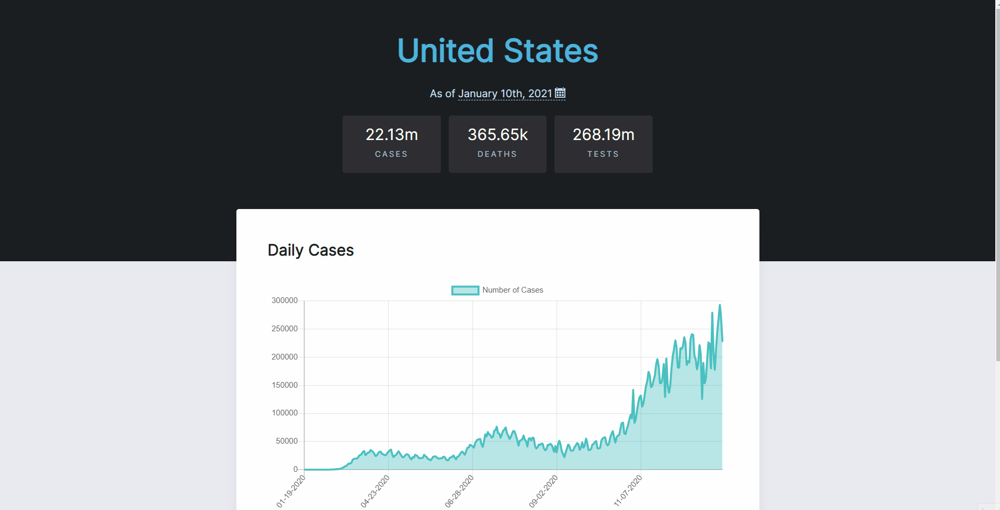

# The Covid Tracker

The Covid Tracker is a simple and clean visual way to view COVID-19 data at a glance. View the live site [here](https://www.suhasjagannath.com/TheCovidTracker/)!

## Overview
The Covid Tracker was built in 12 hours during the [2020 CutieHack Hackathon](https://devpost.com/software/covid-tracker-uqnt73). This project was given CutieHack's **Best UI/UX Hack Award**. This site pulls data from the a COVID tracker database and interprets it into easily readable information with a clean UI. The main challenge I ran into was the time crunch as my power was out for about 2 hours, so I was not able to get all that I wanted done. This was one of my first REACT projects and through this project I was able to learn how basic components function.

## How I built it
Technologies Used: 
- React
- HTML
- JSX
- CSS

In addition, I pulled the data from the API that you can find [here](https://www.covidtracking.com).

## Future Developments
In the future I hope to take advantage of the users location to automatically show them statistics for their area. I also want to be able to show more statistics other than daily cases.
